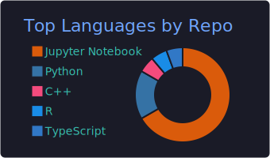
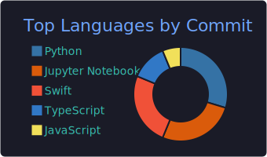
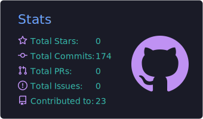
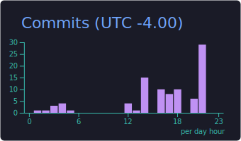

## GitHub Analytics

   
  

  
  

  
  

---
## Open Source Projects

### Machine Learning & AI
<table>
  <tr>
    <td align="center" width="90"></td>
    <td>
      <a href="https://github.com/riteshv7/Project-x"><b>Project-x: IPL Win Predictor</b></a>
      &nbsp;&nbsp;
      
       
      A logistic regression machine learning model predicting IPL cricket match win probabilities using ball-by-ball historical data.
    </td>
  </tr>
</table>

### Web Applications & Utilities
<table>
  <tr>
    <td align="center" width="90"></td>
    <td>
      <a href="https://github.com/riteshv7/QuickStash"><b>QuickStash Focus Board</b></a>
      &nbsp;&nbsp;
      
      &nbsp;
      
       
      A lightweight, distraction-free Chrome extension for capturing ideas instantly and managing daily tasks in a beautiful new tab dashboard.
    </td>
  </tr>
  <tr>
    <td align="center" width="90"></td>
    <td>
      <a href="https://github.com/riteshv7/bread-tycoon-timer-extension"><b>🍞 Bread Tycoon Timer</b></a>
      &nbsp;&nbsp;
      
      &nbsp;
      
       
      Chrome extension (Manifest V3) with a side panel UI that tracks cooldown timers for Bread Tycoon — ads, yeast, discounts & shields — with persistent alarms and sound notifications.
    </td>
  </tr>
  <tr>
    <td align="center" width="90"></td>
    <td>
      <a href="https://github.com/riteshv7/findmyroomie"><b>FindMyRoomie</b></a>
      &nbsp;&nbsp;
      
       
      A web application designed to help university students search for and connect with compatible roommates.
    </td>
  </tr>
  <tr>
    <td align="center" width="90"></td>
    <td>
      <a href="https://github.com/riteshv7/sachcheck"><b>SachCheck Fact-Checking</b></a>
      &nbsp;&nbsp;
      
       
      A fact-checking and truth-verification utility helping users evaluate the reliability of news and claims.
    </td>
  </tr>

  <tr>
    <td align="center" width="90"></td>
    <td>
      <a href="https://github.com/riteshv7/Maidan"><b>Maidan — Live Cricket Widget</b></a>
      &nbsp;&nbsp;
      
      &nbsp;
      
       
      Premium native macOS menu bar agent displaying real-time scores, win probability charts, live crease statistics (batters/bowlers), custom notifications, and sleep-aware adaptive polling with zero dock clutter.
    </td>
  </tr>
</table>

## Dev Quote

  

### Let's Connect!

